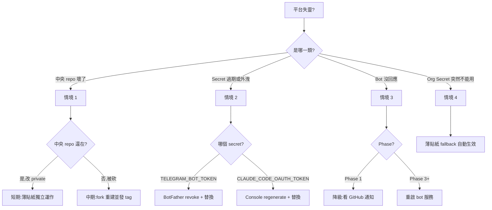

# Disaster Recovery — dev-automation 平台

**Date:** 2026-06-21
**Status:** Phase 0(必做,在 Phase 1 之前)
**Owner:** yimingc-1010(個人帳號)
**對應 spec:** [`2026-06-21-dev-automation-platform-design.md`](./superpowers/specs/2026-06-21-dev-automation-platform-design.md)

---

## 為什麼需要這份文件

平台化最怕「中央死掉全部跟著死」。本文件預先回答 4 個最常見的失靈情境,確保:

1. 中央 repo 失能(被砍、變 private、誤刪 workflow)時,各產品 repo 仍能繼續運作或快速還原。
2. Secret 外洩 / 過期時,有清楚的 rotate SOP。
3. 從個人帳號升級成 Org 帳號(或反向)時,有可逆的搬遷路徑。
4. Telegram bot 常駐服務掛掉時,有降級模式(僅通知失靈,但接單仍可運作)。

---

## 情境 1:中央 `dev-automation` repo 失能

### 失能類型與影響

| 失能類型 | 影響範圍 | 嚴重度 |
|----------|----------|--------|
| Repo 被改為 private | 公開 tag 仍可被 `@v1` 引用,但開發者看不到原始碼、不能 debug | 中 |
| Repo 被砍 | 所有釘 `@v1` 的薄貼紙 workflow 仍可跑(已 cache),但無法更新到下一個 minor | 高 |
| 單支 workflow 被誤刪 | 只有用到該 workflow 的薄貼紙壞掉 | 低 |
| GitHub Actions 大規模 outage | 中央與薄貼紙一起停擺 | 外部依賴,無法自救 |

### 個人帳號 mode(目前實際狀態)

薄貼紙設計原則:**「可獨立運作」優先於「集中管理」**。

每個產品 repo 的 `.github/workflows/claude.yml` 與 `notify.yml` 內容包含完整邏輯,不依賴 `uses: yimingc-1010/dev-automation/.github/workflows/claude.reusable.yml@v1`。

退化 SOP(中央失能時):

1. **短期(0–24h):** 薄貼紙直接呼叫 `anthropics/claude-code-action@v1` + 內聯 notify script(不經 reusable)。這是預設設計,正常狀態就這樣跑。
2. **中期(1–7 天):** 在 fork 或本地備份建立臨時中央 repo,改名 `yimingc-1010/dev-automation` 後發 `@v1` tag。薄貼紙不用改。
3. **長期:** 還原正式中央 repo 後,薄貼紙的 `@v1` 指標會自然指向新版本。

### Org 帳號 mode(Phase 3+ 評估)

升級路徑在 spec「版本策略」段已定義:

- 中央用 SemVer tag;產品 repo 釘 `@v1`(major 鎖死)。
- 中央改動不即時影響釘舊 tag 的 repo — 即使中央被砍,釘 `@v1.2.3` 的 repo 仍可繼續工作,直到 bump major。
- Breaking change 才 bump major 並提前通知各 repo owner。

Org Secret 失效時:fallback 邏輯在「情境 2」說明。

### 復原演練(每半年)

- 在 fork 上跑一次「中央失能模擬」:把 fork 改 private,驗證 home-splat 與第二個 repo 的薄貼紙仍能跑通。
- 紀錄於 `docs/dr-drills/`(目前未建,Phase 1 完成後補)。

---

## 情境 2:Secret 過期 / 外洩 — Rotate SOP

### 目前使用的 Secret(來自 spec 第 5 節)

| Secret | 用途 | 儲存位置 |
|--------|------|----------|
| `CLAUDE_CODE_OAUTH_TOKEN` | Claude 訂閱 token,給 `claude.reusable.yml` 用 | 個人帳號:每 repo 設。Org:Org Secret。 |
| `TELEGRAM_BOT_TOKEN` | Telegram bot 認證 | 個人帳號:每 repo 設。Org:Org Secret。 |

### 個人帳號 mode 的 Rotate 流程

**Phase A — 偵測(預警)**

- Claude token:Claude 訂閱過期前 7 天,claude-code-action 會在 workflow log 印 warning。在 `notify.yml` 內加 step:`if: failure() && contains(steps.claude.outputs.error, 'token')` → Telegram 推「Claude token 過期警告」。
- Telegram token:無內建預警,需要每 90 天手動檢查一次(BotFather 不會主動通知)。

**Phase B — Rotate**

1. **Telegram token:**
   - BotFather → `/revoke` → 拿新 token。
   - 進每個產品 repo 的 Settings → Secrets → 刪舊 `TELEGRAM_BOT_TOKEN`,貼上新值。
   - 共用同一個 bot(只一組 token)時,只需換一處。
   - 驗證:隨便觸發一次 workflow,確認 Telegram 收到通知。

2. **Claude OAuth token:**
   - 到 [Anthropic Console](https://console.anthropic.com) regenerate token。
   - 進每個產品 repo 的 Settings → Secrets → 替換 `CLAUDE_CODE_OAUTH_TOKEN`。
   - **每 repo 各自的 token(預設)—** spec 限制表第 4 條要求「預設每 repo 自己的 token」,避免 throttle 共用風險。

3. **若是 Org Secret:**
   - Settings → Organization → Secrets → 編輯。
   - 所有引用 `secrets: inherit` 的 repo 自動生效,無須逐 repo 改。

**Phase C — 驗證**

- 在 home-splat 開一個測試 issue 留言 `@claude /status`,確認 Claude 能開 PR。
- 確認 Telegram 收到「PR created」通知。

**Phase D — 撤銷舊 token**

- 確認所有 repo 都已換新 token 後,到 Anthropic Console 撤銷舊 token。
- Telegram 舊 token 已被 `/revoke` 自動失效,不用再處理。

### 個人帳號 → Org 帳號 的搬遷

情境:未來想把 dev-automation 與所有產品 repo 搬到 GitHub Organization(為了 Org Secret 一處設定全 repo 繼承)。

**搬遷步驟:**

1. **建立 Org:** GitHub → Create Organization,命名建議 `yourorg`(範例用,實際命名由你決定)。
2. **搬 repo:** 從個人帳號下 transfer `dev-automation` 與所有產品 repo 到 Org。
   - 注意:transfer 後 GitHub Actions secrets 不會自動跟著搬,需要在新位置重新設定。
3. **重新設 Org Secret:** 在 Org 的 Settings → Secrets 把 `CLAUDE_CODE_OAUTH_TOKEN` 與 `TELEGRAM_BOT_TOKEN` 設進去。
4. **薄貼紙更新:** 把 `secrets: inherit` 改為 `secrets: CLAUDE_CODE_OAUTH_TOKEN`(明示引用,fallback 邏輯保留)。
5. **驗證:** 跑一次 home-splat 端到端流程,確認 Org Secret 生效。

**反向(Org → 個人):** 同上,只是方向顛倒,並把 Org Secret 改為每 repo 自己的 secret。

---

## 情境 3:Telegram Bot 常駐服務掛掉

### Bot 服務定位

Phase 1:bot 不存在,只有 GitHub workflow 主動推通知(走 Telegram HTTP API)。
Phase 3+ 才部署常駐 bot 服務(Render / Fly.io / 個人 VPS),用來接收 `/pause` `/replan` `/priority` 指令。

### Phase 1 失靈情境

- Telegram API 本身掛了:workflow 內 `curl` 會失敗,但 GitHub workflow 仍正常跑。Claude 會開 PR,只是開發者不會被通知。
- **降級:** 開發者直接看 GitHub Notifications 與 PR 列表(狀態平面仍正常運作)。

### Phase 3+ 失靈情境

| 失靈類型 | 症狀 | 降級方式 |
|----------|------|----------|
| Bot 程序崩潰 | Telegram 推指令無回應;但 workflow 通知仍可推(因為 notify.reusable 直接用 token 呼叫 API) | 重啟 bot 服務;短期可手動下指令透過 `gh workflow run` |
| Telegram webhook 沒接上 | bot 收不到使用者訊息 | 重啟時 webhook 重新註冊;驗證:在 Telegram 傳 `/ping`,bot 應回 `pong` |
| Bot token 過期 | 全部指令失敗 | 走情境 2 Phase B 流程 |

### 部署健康檢查(Phase 3+)

bot 服務內部署 `/health` endpoint,監控服務如 UptimeRobot 每 5 分鐘打一次。失敗 3 次告警到 email。

---

## 情境 4:從 Org Secret 退回 Repo-level(個人帳號)

這個情境比較少見但 spec 限制表第 3 條有提到:Org 撤掉後,所有 repo 必須獨立設 secret。

### 自動 Fallback(已寫進薄貼紙)

薄貼紙內的 `secrets:` 區塊會:

```yaml
secrets:
  CLAUDE_CODE_OAUTH_TOKEN:  # 嘗試讀 org secret,fallback 到 repo secret
    required: false
  TELEGRAM_BOT_TOKEN:
    required: false
```

加上 PR 開啟時的 warning step(在 `claude.reusable.yml` 內):

```yaml
- name: warn-if-no-org-secret
  if: ${{ ! env.CLAUDE_CODE_OAUTH_TOKEN }}
  run: |
    echo "::warning::CLAUDE_CODE_OAUTH_TOKEN 為空,請搬回 org level 以集中管理"
```

### 手動 Fallback(Org 永久失效)

1. 確認目前所有 repo 都已有 repo-level secret(薄貼紙 fallback 設計)。
2. 把 `secrets: inherit` 從所有薄貼紙移除,改為 `secrets: CLAUDE_CODE_OAUTH_TOKEN`(明示)。
3. 驗證所有 repo 仍可跑。

---

## 決策樹:遇到問題時該看哪一段



*預覽圖: [SVG](./superpowers/specs/assets/04-dr-decision-tree.svg) · [PNG](./superpowers/specs/assets/04-dr-decision-tree.png)*

---

## 預防性檢核清單(每月)

- [ ] home-splat 與第二個產品 repo 的 workflow 仍可成功觸發(end-to-end smoke test)
- [ ] `CLAUDE_CODE_OAUTH_TOKEN` 與 `TELEGRAM_BOT_TOKEN` 仍有效(各跑一次測試 workflow)
- [ ] Telegram bot 服務(若已部署)的 `/health` endpoint 正常
- [ ] 中央 repo 的 `@v1` tag 仍存在(沒被 force-push 覆蓋)
- [ ] 任何加入的新產品 repo 都已完成 SOP「貼兩張貼紙 + 設 variable + 5 分鐘內」(Phase 2 驗收條件 3)

---

## 變更紀錄

| 日期 | 版本 | 變更 |
|------|------|------|
| 2026-06-21 | v0.1 | 初版,涵蓋 4 個情境 + 決策樹 + 月度檢核清單 |