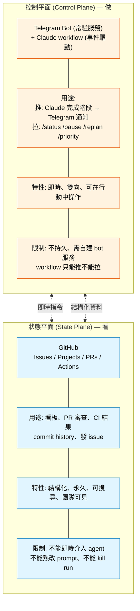
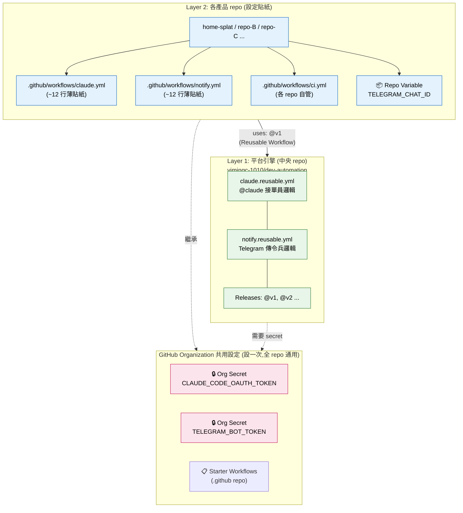
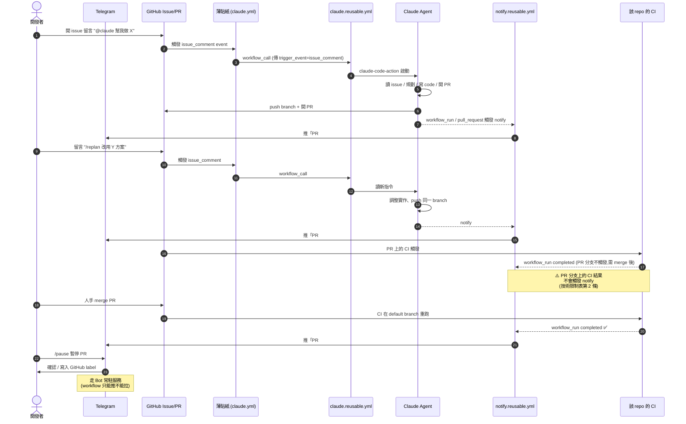

# Dev Automation Platform — Design

**Date:** 2026-06-21
**Version:** v0.1 (post-review revisions)
**Status:** Reviewing — incorporates 2026-06-21 design review feedback

## 設計回顧結論 (v0.1 變更摘要)

本版相對初稿的關鍵修正:

1. **控制平面 / 狀態平面分工明確化** — Telegram 從「純通知」升級為「控制平面」(接收指令、調整優先序、暫停 agent),GitHub 退為「狀態平面」(看板、PR、CI)。合併原準則 [2] 與 [4]。
2. **補上 3 條技術限制**(詳見「技術限制」表):reusable workflow 內 `github.event_name` 會是 `workflow_call` 必須用 input 傳遞;`workflow_run` 在 PR 分支不觸發;Org Secret 在個人帳號不可用。
3. **加入 Reviewer 角色** — 與 subagent-driven-development skill 的「implementer 自審 = red flag」一致,薄貼紙串兩個 claude-code-action job。
4. **補上 Phase 0 (Disaster Recovery)** 與 **Phase 1 驗收條件** — 原稿只有 Phase 1 起步點,沒有「什麼算 Phase 1 跑完」的定義。
5. **Mermaid 圖** — 把 ASCII 圖換成 GitHub 原生渲染的 Mermaid(flowchart + sequenceDiagram),並新增「事件觸發流程」時序圖。
6. **接單員可抽換設計預留** — Phase 1 硬綁 Claude,Phase 2+ 視需求平行加入 codex / openrouter / custom 等可選引擎。介面約束:`secrets:` 介面統一,薄貼紙只換 `uses:`。

## 目標

把「GitHub-driven 自治開發流程」從單一 repo 的腳本,升級成可跨多個 repo 一鍵套用的平台。核心原則:**共用的引擎集中管理、版本化;各 repo 只放一張薄薄的設定貼紙。**

## 非目標 (YAGNI)

- 不共用 CI(build/test/lint 指令因語言/框架不同,天生無法通用)。
- 不共用部署邏輯(Vercel / Cloudflare / 自架各異)。
- 不做 auto-merge(merge 永遠由使用者手動把關)。
- 不做跨 repo 的 issue 同步或 project board 整合。

## 兩種平面(原準則 [2] 與 [4] 合併重寫)

原設計把 GitHub 與 Telegram 各自描述,但兩者職責重疊——Telegram 只接收、GitHub 不能即時介入。
本版明確分工:



*預覽圖: [SVG](./assets/01-control-data-plane.svg) · [PNG](./assets/01-control-data-plane.png)*

**實際分工:**

| 動作 | 平面 | 觸發者 |
|------|------|--------|
| 開 issue 描述需求 | 狀態 | 人 |
| 標 issue 為 in-progress | 狀態 | agent 自動 |
| 看 PR diff | 狀態 | 人 |
| 「PR #42 CI 失敗,Claude 已 fix」 | 控制 → 推 | workflow → Telegram |
| 「/pause 暫停 PR #42 的 agent」 | 控制 → 拉 | Telegram → bot → workflow API |
| 「/priority 把 issue #7 拉到最高」 | 控制 → 拉 | Telegram → bot → GitHub API |

**Telegram Bot 常駐服務**(本次 v0.1 新增元件):

- 不是 workflow,是獨立的 HTTP 服務(推薦 Python aiohttp,~100 行)
- 釘在 dev-automation repo 內的 `bot/` 目錄
- 部署在 Render / Fly.io / 個人 VPS(免費 tier 即可)
- 接收 Telegram webhook → 解析指令 → 呼叫 GitHub API 或 workflow_dispatch
- 屬於「非目標:不做跨 repo issue 同步」範圍外——只做指令轉發

## 兩層架構



*預覽圖: [SVG](./assets/02-phase-roadmap.svg) · [PNG](./assets/02-phase-roadmap.png)*

## 元件設計

### 1. 中央 repo：`yimingc-1010/dev-automation`

**職責:**
- 存放兩支 reusable workflow。
- 用 GitHub Releases + tag(`@v1`)版本化,產品 repo 釘住 tag,中央升級不會炸別人。
- README 說明如何接入新 repo(5 分鐘接入目標)。

**檔案結構:**
```
dev-automation/
├─ .github/workflows/
│   ├─ claude.reusable.yml     # 實際的接單員邏輯(Phase 1)
│   └─ notify.reusable.yml     # 實際的傳令兵邏輯
└─ starter-workflows/
    ├─ claude.starter.yml      # 薄貼紙範本(用於 Starter Workflows)
    └─ notify.starter.yml      # 薄貼紙範本
```

**未來擴充(Phase 2+ 評估,不阻塞 Phase 1):**

目前接單員引擎硬綁 Claude(`anthropics/claude-code-action@v1`)。日後若需多模型支援,中央 repo 平行新增 workflow:

```
├─ .github/workflows/
│   ├─ claude.reusable.yml      # Claude Code 訂閱路徑
│   ├─ codex.reusable.yml       # OpenAI Codex CLI(待評估)
│   ├─ openrouter.reusable.yml  # OpenRouter 多模型(待評估)
│   └─ custom.reusable.yml      # 自訂 LLM API 殼層(待評估)
```

設計約束:每支 reusable 的 `secrets:` 介面要統一,薄貼紙只換 `uses:` 即可切換引擎,不必改其他設定。

Phase 1 不實作,只在 Phase 2 評估是否值得抽象化(觸發條件:第 2 個產品 repo 接入、且該 repo 明確不要用 Claude)。

### 2. `claude.reusable.yml` — 接單員引擎

```yaml
on:
  workflow_call:
    secrets:
      claude_code_oauth_token:
        required: true
```

觸發條件、`if:` 判斷、`permissions:`、`anthropics/claude-code-action@v1` 的呼叫全部在這裡。產品 repo 的薄貼紙只負責「接收事件 → 呼叫這支」。

**技術限制:** GitHub Reusable Workflow 的 `on: workflow_call` 無法直接繼承呼叫方的事件(`github.event`)——呼叫方必須用 `workflow_call` 把自己的觸發事件「轉接」進來。因此薄貼紙需要宣告同樣的 `on:` 觸發(issue_comment / pull_request_review_comment / issues / pull_request_review),再用 `if:` 篩選,最後 `uses: yimingc-1010/dev-automation/.github/workflows/claude.reusable.yml@v1`。

→ **接單員引擎主要複用的是「步驟邏輯」,觸發條件由薄貼紙宣告(一份模板,複製即用)。** 真正節省的是「claude-code-action 的設定、升級、維護」集中一處。

### 3. `notify.reusable.yml` — 傳令兵引擎

```yaml
on:
  workflow_call:
    inputs:
      chat_id:
        required: true
        type: string
    secrets:
      telegram_bot_token:
        required: true
```

Build message / Send 邏輯完全在中央。`chat_id` 作為 input 傳入(每個 repo 可送不同 Telegram 頻道)。

**技術限制:** `workflow_run`(用於監聽 CI 結果)和 `deployment_status` 觸發也必須在呼叫方的薄貼紙宣告——reusable workflow 無法自己監聽這些事件。所以薄貼紙要宣告 `on: { pull_request, workflow_run, deployment_status }`,再 call 中央。**傳令兵引擎真正共用的是訊息組裝邏輯與 Telegram curl 呼叫。**

### 4. 薄貼紙(各 repo 的 claude.yml / notify.yml)

每支 ~12–20 行,只做三件事:
1. 宣告 `on:` 觸發
2. 可能的 `if:` 篩選
3. `uses: yimingc-1010/dev-automation/...@v1` + 傳入參數/secret

```yaml
# 產品 repo 的 notify.yml 範例
name: Telegram Notify

on:
  pull_request:
    types: [opened, reopened]
  workflow_run:
    workflows: ["CI"]        # 改成此 repo 的 CI workflow name
    types: [completed]
  deployment_status:

jobs:
  notify:
    uses: yimingc-1010/dev-automation/.github/workflows/notify.reusable.yml@v1
    secrets:
      telegram_bot_token: ${{ secrets.TELEGRAM_BOT_TOKEN }}
    with:
      chat_id: ${{ vars.TELEGRAM_CHAT_ID }}
```

### 5. Org-level Secrets

| Secret | 說明 | 適用範圍 |
|--------|------|----------|
| `CLAUDE_CODE_OAUTH_TOKEN` | Claude 訂閱 token,給 `claude.reusable.yml` 用 | Phase 1 唯一需要 |
| `TELEGRAM_BOT_TOKEN` | 共用同一個 bot | 全部 phase |

Phase 2+ 視需求加入:
- `OPENAI_API_KEY`(若啟用 codex.reusable.yml)
- `OPENROUTER_API_KEY`(若啟用 openrouter.reusable.yml)
- `CUSTOM_LLM_API_KEY`(若啟用 custom.reusable.yml)

設一次,所有 org 內 repo 繼承(薄貼紙用 `secrets: inherit` 或明確引用)。

### 6. Repo-level Variable

| Variable | 說明 | 設定位置 |
|----------|------|--------|
| `TELEGRAM_CHAT_ID` | 此 repo 的通知頻道 | 各 repo Settings → Variables |

這讓每個專案可以送到不同的群組/私聊。

### 7. Starter Workflows(`.github` repo)

在 org 下建一個特殊的 `.github` repo,把薄貼紙放進 `workflow-templates/` 目錄。之後任何 repo 按「New workflow」時,Claude+Notify 就會出現在選單——一鍵套用。

## 接入新 repo 的 SOP(平台就緒後)

1. 從 Starter Workflows 套用 `claude.starter.yml` 和 `notify.starter.yml`(或手動複製兩張薄貼紙)。
2. 在 repo Settings → Variables 設 `TELEGRAM_CHAT_ID`(此專案的 Telegram 頻道 id)。
3. 確認此 repo 的 CI workflow `name:` 與 `notify.yml` 裡的 `workflows: ["CI"]` 一致。
4. 接好部署(Vercel 等)。
5. 開一張測試 issue 留言 `@claude` 驗證。

**Org secrets 不用動**——已涵蓋。**中央邏輯不用動**——中央管。接入時間目標:< 10 分鐘。

## 版本策略

- 中央 repo 用 SemVer tag:`v1.0.0`、`v1.1.0`、`v2.0.0`。
- 產品 repo 釘住 major tag(`@v1`),minor/patch 自動升。
- Breaking change 才 bump major 並提前通知各 repo。
- **中央改動不會即時影響釘住舊 tag 的 repo**——安全升級。

## 演進路線

```
Phase 0(必做,在 Phase 1 之前): 災難復原文件
  └─ docs/disaster-recovery.md
  └─ 涵蓋:中央 repo 失能 / 怎麼 rotate secret / 從 Org 變 Personal / bot 服務掛了怎麼辦
  └─ 平台化最怕「中央死掉全部跟著死」,先把退場機制寫清楚

Phase 1(現在): home-splat 單 repo 驗證
  └─ 直接寫三支 workflow 進 home-splat,end-to-end 跑通
  └─ 驗收條件(必全部通過才算 Phase 1 完成):
     [ ] 在 home-splat 開 issue 留言 @claude → Claude 開 PR
     [ ] PR 上的 CI 跑完 → Telegram 收到通知(merge 前就收到)
     [ ] 開另一個 issue 留言 @claude /replan → Claude 變更計畫並更新 PR
     [ ] CI 失敗 → Claude 自動讀 log 修正 → push 同一個 branch
     [ ] 人手 merge PR → Telegram 收到「merged」通知
     [ ] 留底截圖與 log,作為 Phase 2 對照基準
  └─ 對應計畫:2026-06-20-github-driven-autonomous-dev.md

Phase 2(驗證後): 抽出平台引擎
  └─ 建 dev-automation repo
  └─ 把邏輯搬進 reusable workflow(claude + reviewer + notify)
  └─ home-splat 改成薄貼紙 + uses:
  └─ 設 Org secrets(含 fallback 邏輯)
  └─ 把 Phase 1 留底的 5 個情境,在新平台上各跑一次驗證不退步

Phase 3(穩定後): 推廣
  └─ 建 .github repo + Starter Workflows
  └─ 部署 Telegram bot 常駐服務(bot/)
  └─ 開第二個 repo 接入,計時是否在 10 分鐘內
  └─ 啟用 Dependabot / Renovate 自動 PR 升 @v1 → @v2
```

**Phase 1(home-splat 測試)就是現有的實作計畫 `2026-06-20-github-driven-autonomous-dev.md`。Phase 2 才是本 spec 的實作。**

## 事件觸發流程(從 @claude 留言到 Telegram 通知)



*預覽圖: [SVG](./assets/03-state-machine.svg) · [PNG](./assets/03-state-machine.png)*

## 技術限制與取捨摘要

| 限制 | 影響 | 處理方式 |
|------|------|----------|
| Reusable Workflow 看不到呼叫方的原始事件 | 觸發條件無法完全集中;`github.event_name` 在 reusable 內會是 `workflow_call` 而非真實事件,claude-code-action 會選錯 prompt template | 薄貼紙宣告觸發;reusable workflow 用 `inputs.trigger_event` 接收真實事件名稱,內部 step 改用此 input |
| `workflow_run` 只認 default branch 上的 workflow 定義 | PR 分支上的 CI 結果不會觸發 notify;開發者會誤以為 notify 壞了 | (1) 薄貼紙另外宣告 `pull_request: [opened]` 觸發「開始追蹤此 PR」訊息(2) README 明確標註「merge 後才會收到 CI 通知」 |
| Org secrets 需要 GitHub 組織帳號 | 個人帳號 repo 必須每個 repo 設 secret,無法一處設定全 repo 繼承 | 薄貼紙 fallback:若 `TELEGRAM_BOT_TOKEN` / `CLAUDE_CODE_OAUTH_TOKEN` 為空,改讀 repo-level secret,並在 PR 開啟時印 warning 建議搬到 org level |
| 共用 Claude OAuth token 有 throttle 風險 | 一個 repo 觸發訂閱上限,所有 repo 跟著被 throttle | 預設每 repo 自己的 token(透過 `secrets.CLAUDE_CODE_OAUTH_TOKEN` 覆寫,fallback 到 org secret);薄貼紙不強制共用 |
| Claude implementer 自審 = red flag | 同一個 agent 寫 code 又 review 容易漏抓盲點 | 薄貼紙串兩個 claude-code-action job(implementor + reviewer)用不同 prompt;Phase 2 實作 |

## 驗收標準(Phase 2 完成時)

1. 中央 `dev-automation` repo 存在,reusable workflow 有 tag `@v1`。
2. `home-splat` 的 `claude.yml` / `notify.yml` 精簡成 ~15 行薄貼紙,邏輯已移出。
3. 接一個新 repo 只需要:貼兩張貼紙 + 設一個 variable + 5 分鐘以內。
4. 中央更新訊息格式(只改 `notify.reusable.yml`)後,home-splat 下次觸發自動套用新格式,無需改 home-splat 自己的檔案。
